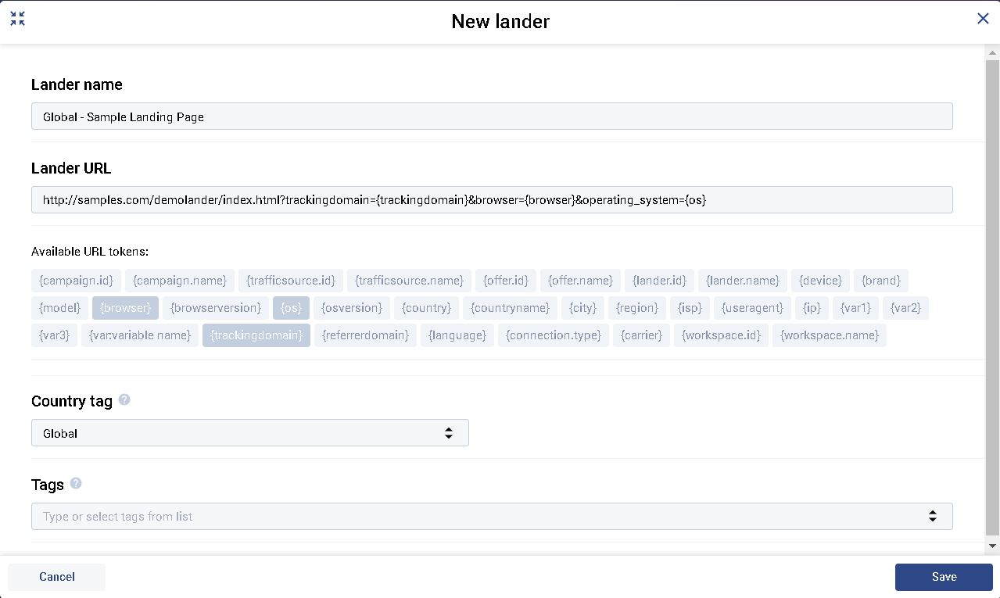

/* -------------------------------- TECHNOLOGY STACK --------------------------------- */

* AWS LAMBDA
* SERVERLESS/Microservice architecture
* DYNAMO DB
* NODEJS
* I also need someone to set up an enviroment on AWS and GITHUB where multiple developers can contribute
---

/* ------------------------ LIST OF FORMS IN THE APPLICATION ----------------------------- */

* CAMPAIGNS FORM
* OFFER FORM
* LANDER FORM
* TRAFFIC SOURCES FORM
* AFFILIATE NETWORK FORM

## LANDER FORM

When a user visits the lander URL, all the tokens are inerted to the database. The tokens can also be appended to the URL. When it is appended to the URL these tokens can be used in the landing page like shown below

Hello user from {CITY}  will be converted as -> Hello user from Coimbatore

Other Details that you will have to insert to the database

* Lander
* Lander ID
* Lander URL
* Lander Country tag

* Visits  - The number of times the lander has be loaded in the browser
* Clicks  - The number of people who clicked the lander and visited the offer page

---
