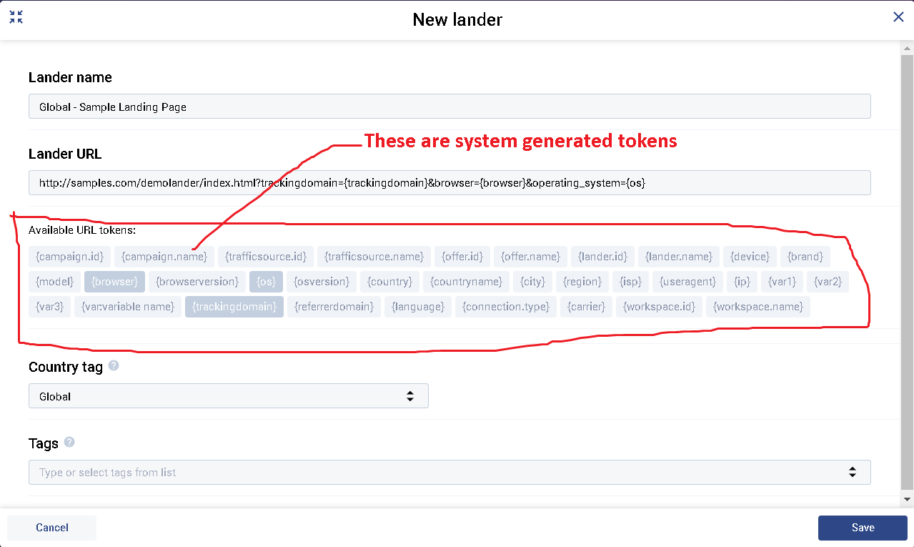
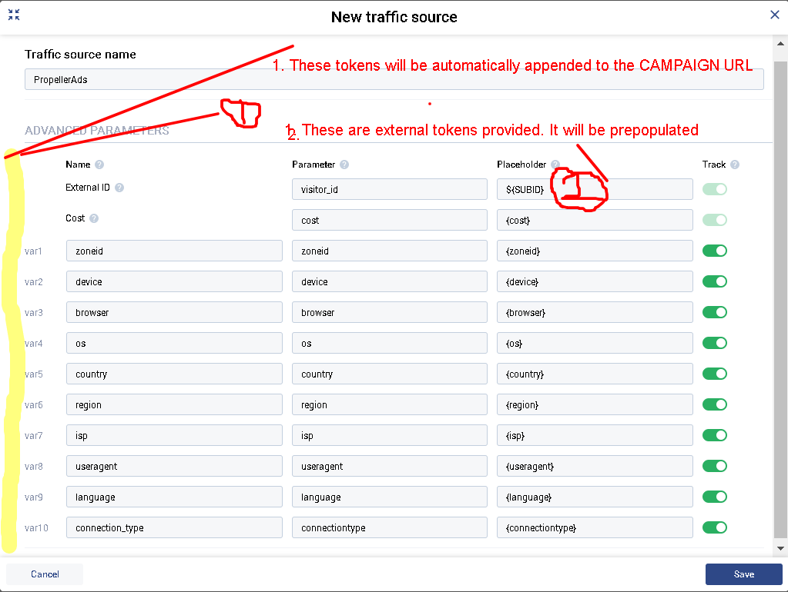
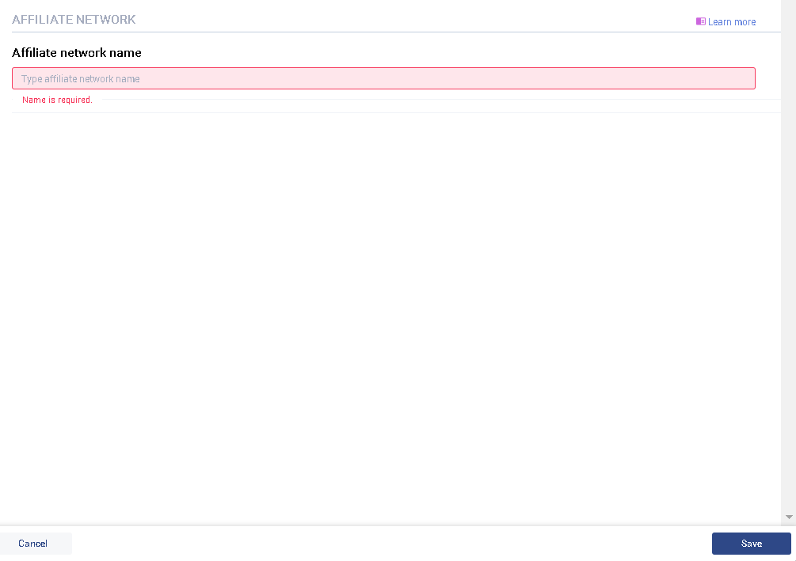
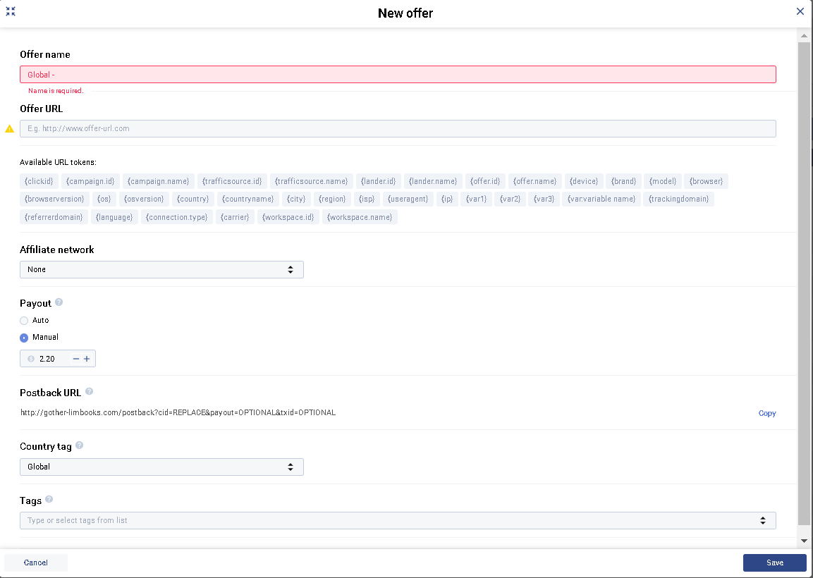
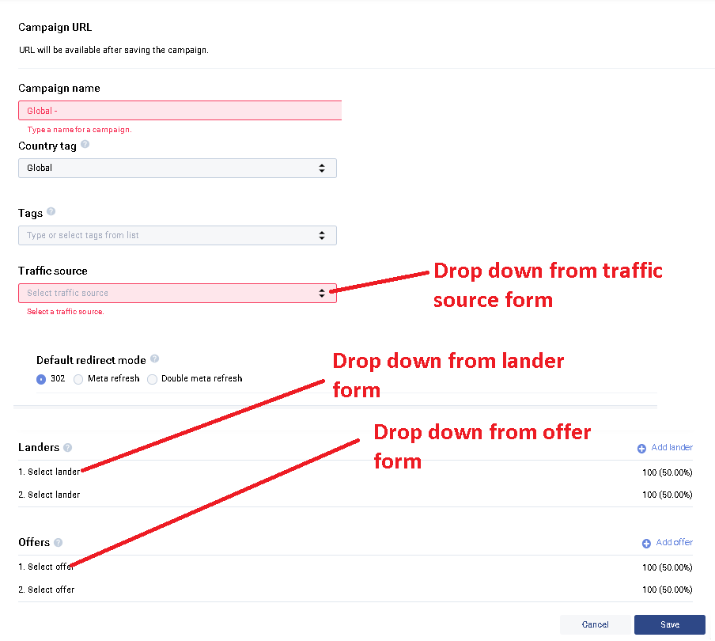
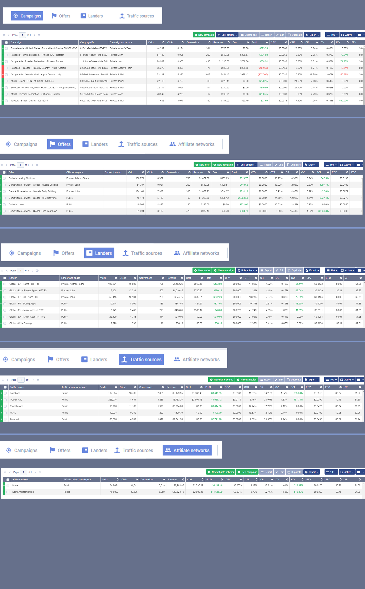

/* -------------------------------- TECHNOLOGY STACK --------------------------------- */

* AWS LAMBDA
* SERVERLESS/Microservice architecture
* DYNAMO DB
* NODEJS
* I also need someone to set up an enviroment on AWS and GITHUB where multiple developers can contribute
---

/* ------------------------ LIST OF FORMS IN THE APPLICATION ----------------------------- */

* CAMPAIGNS FORM
* OFFER FORM
* LANDER FORM
* TRAFFIC SOURCES FORM
* AFFILIATE NETWORK FORM

## :green_book: LANDER FORM

When a user visits the lander URL, all the tokens are inerted to the database. The tokens can also be appended to the URL. When it is appended to the URL these tokens can be used in the landing page like shown below

Each token should be written as a seperate Lambda function.

Hello user from {CITY}  will be converted as -> Hello user from Coimbatore

Other Details that you will have to insert to the database

* Lander - Lander Name
* Lander ID - cc6691ce-ebd0-43ae-a249-a92001627c00
* Lander URL - URL of the lander
* Lander Country tag

* Visits  - The number of times the lander has be loaded in the browser
* Clicks  - The number of people who clicked the lander and visited the offer page

---

## :green_book: TRAFFIC SOURCES FORM 

There are so many traffic sources like Google, Facebook etc. Each traffic source will have its set of tokens. I will be adding all the traffic source and its set of tokens to the system.

---

## :green_book: Affiliate Network FORM

## :green_book: OFFER FORM

## :green_book: CAMPAIGN FORM

---

Under campaign you can link a landing page and offer page. This is a sample campaign URL

When you create a new campaign you will have to link and landing page and offer page. This URL is appended with the tokens which are provided in the traffic source form. If the traffic source is Google Adwords then the corresponding tokens are appended or if the traffic source is facebook ads then the corresponding tokens are appended.

http://gother-limbooks.com/81342a7e-96a9-4476-972d-21184556df1d?zoneid={zoneid}&device={device}&browser={browser}&os={os}&country={country}&region={region}&isp={isp}&useragent={useragent}&language={language}&connection_type={connectiontype}&cost={cost}&visitor_id=${SUBID}

When the visitor clicks the campaign he is routed to the landing page. When the user clicks the button on the landing page he is routed to the offer page.

##Flow

