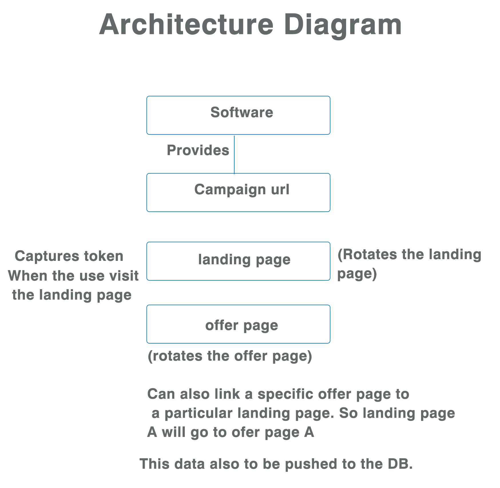
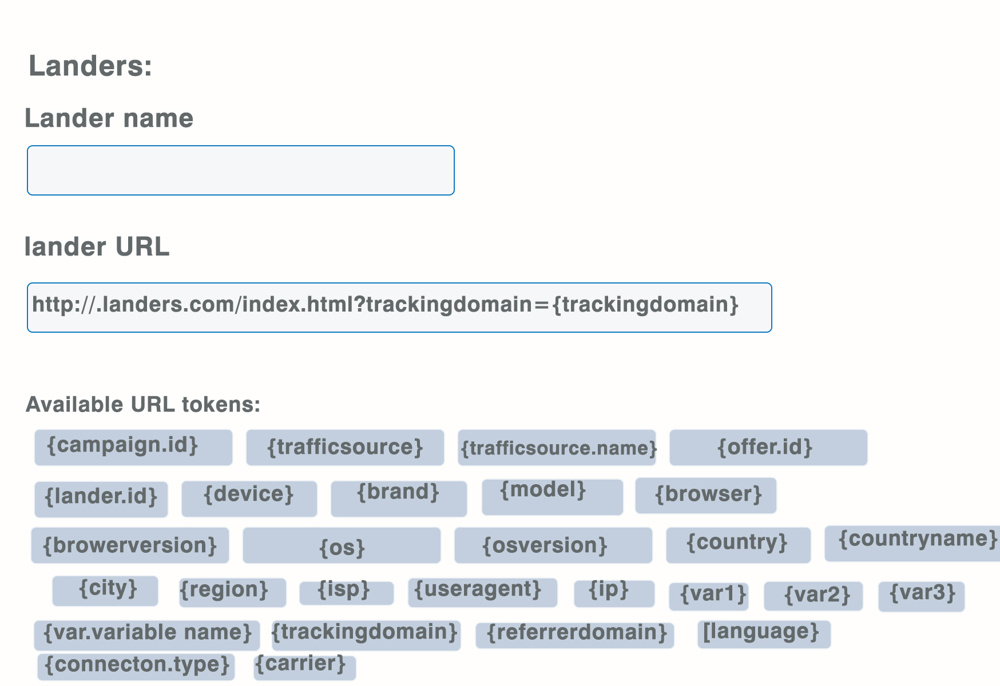
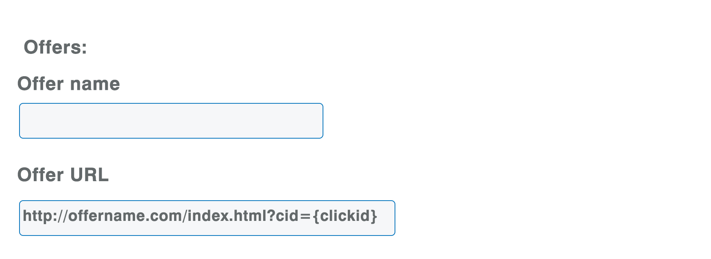
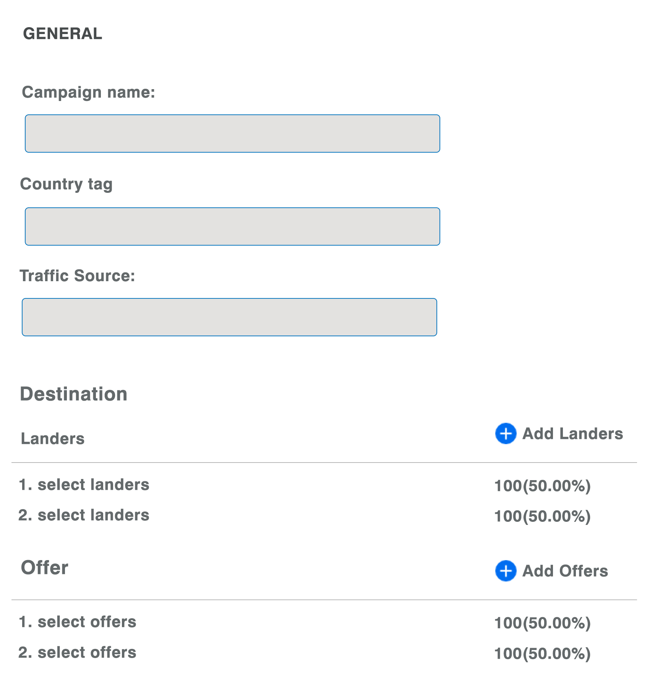
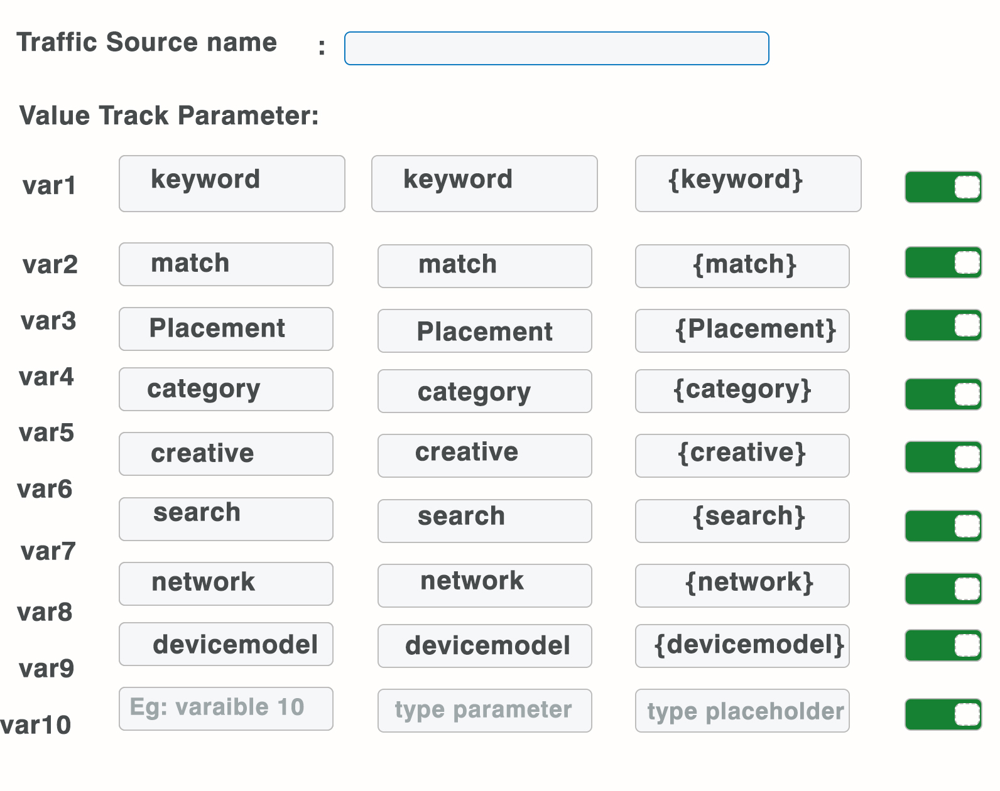
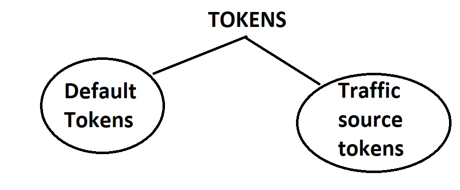

## :boom: 1. Introduction

This is how a typical URL looks. This is the URL that we submit to an adnetwork. When someone clicks the ad the below URL loads and is taken to the appropriate landing page. When the landing page is clicked he is taken to the offer page.

http://gother-limbooks.com/81342a7e-96a9-4476-972d-21184556df1d?zoneid={zoneid}&device={device}&browser={browser}&os={os}&country={country}&region={region}&isp={isp}&useragent={useragent}&language={language}&connection_type={connectiontype}&cost={cost}&visitor_id=${SUBID}

If you refer the above, certain query string are provided by the traffic source and certain will have to be provided by us. For example in the case of ad network propeller ads, the below are the ones provided by them

```
zoneid={zoneid} - Zone id is the placement id where our ad is shown
```

In future these ad works might start providing more tracking tokens

Now in the above URL these are the ones which we will have to populate and not provided by propellerads. These are the default query string that our software should provide

```
{device}
{brand}
{model}
{browser}
{browserversion}
{os}
{osversion}
{country}
{countryname}
{city}
{region}
{isp}
{useragent}
{ip}
{var1} -
{var2}
{var3}
{referrerdomain} 
{language} - browser language
{connection.type}  - broadband or wifi or carrier
{carrier} - Airtel or Vodafone or Jio etc
```

If the adnetwork provides city and state tokens, it is not necessary that I use our tokens rather I can use the adwetworks tokens.

  
  
---

## :boom: 2. Tab - Landers: 

Landing page is basically a presales page

Under this menu I would be able to create any number of landing pages

Fields:

* Lander Name: 
* Lander URL: 
  
  
  
---

## :boom: 3. Tab - Offers: 

Usually companies outsource their marketing needs to a third party. These third parties create a new landing page on top of the offer page.

 Offer is the real landing page of the company


Fields:

* Offer name: 
* Offer URL: http://in.crigroups.com/index.html?cid={clickid}




---

## :boom: 4. Tab: campaign: 

 * Campaign name: 
 * Country: Drop down:
 * Traffic Source: 
 * Landers: Drop down - Select the lander which you have already created
 * Offers: Dropdown - Select the offer which you have already created

Here you are linking both the lander and offer. Campaign tab will provide you a new URL. This is the URL which you use in traffic sources like google adwords, bing, trafficvance etc.
  


---

## :boom: 5. Tab: Traffic sources

* Traffic Source name: 

* Value Track PARAMETERS:



---

## Tracking ID or Click ID or Sub ID (proposed to use with HIT PATH)

In HTPATH or similiar software there will be a list of offers to promote. Our affiliates can pick any offer and promote. To identity them uniquely HITPATH suggests to append clickid ID to the offer URL as shown below. So click id is a unique numeric ID for each and every click. So no two clicks will be the same.

http://offer-URL.com/index.html?cid={clickid}

So when a customer clicks on the link all the data attached to the click including landing pages used for this offer, campaigns etc...is carried with the clickid

Once a conversion occurs(conversion can be form filled or offer page filled) the clickid is passed to the HITPATH alerting the network that a sale or lead was made and this is the clickid that came with it. 

So once a sale or lead occurs the pingback URL is called by HITPATH automatically replacing the cid (check ping back URL). This is then reflected in our software ie. as conversion occured for this clickid.

http://gother-limbooks.com/postback?cid=REPLACE&payout=OPTIONAL&txid=OPTIONAL

Ping back URL: This is the URL which you place in the performance marketing network

Option should also be given to manually update the clickids i.e copy all the clickids from HIT PATH and paste it here in our software. 

Offer URL is always appended with click ID. Offer URL is available in our

---

## Revision





